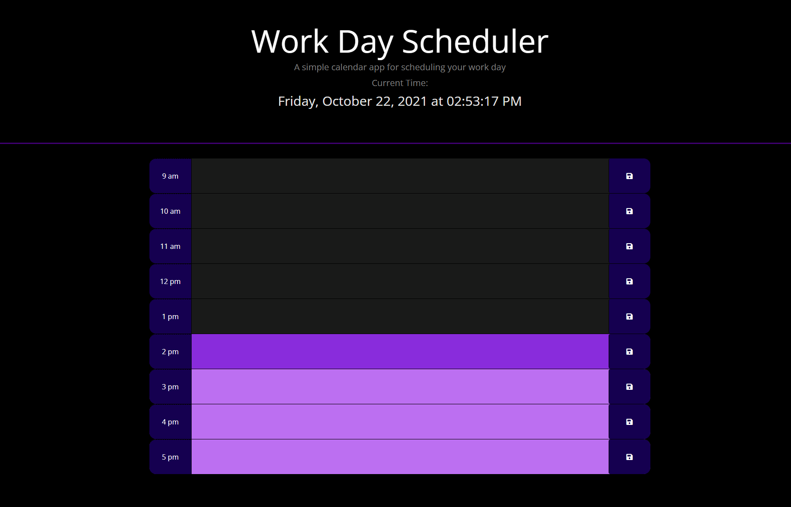

# 05-Work-Day-Scheduler

## Description

A simple day planner that saves user inputs and dynamically updates the current time.

## Assignment

This is the coding quiz assignment by the UCI Full Stack Developer Boot Camp.

Assignment included building a javascript application that dynamically updates time and the planner. The planner is updated in such a way that the fields are color coordinated so the user can see which field is the current time 
and which fields are in the past/future. Items saved to page are stored to the local storage and reinitialized on on re-entry to the page. Pages built using Bootstrap, JQuery and Dayjs.

## Image

## Destination

Url Published at: https://omarace.github.io/05-Work-Day-Scheduler/